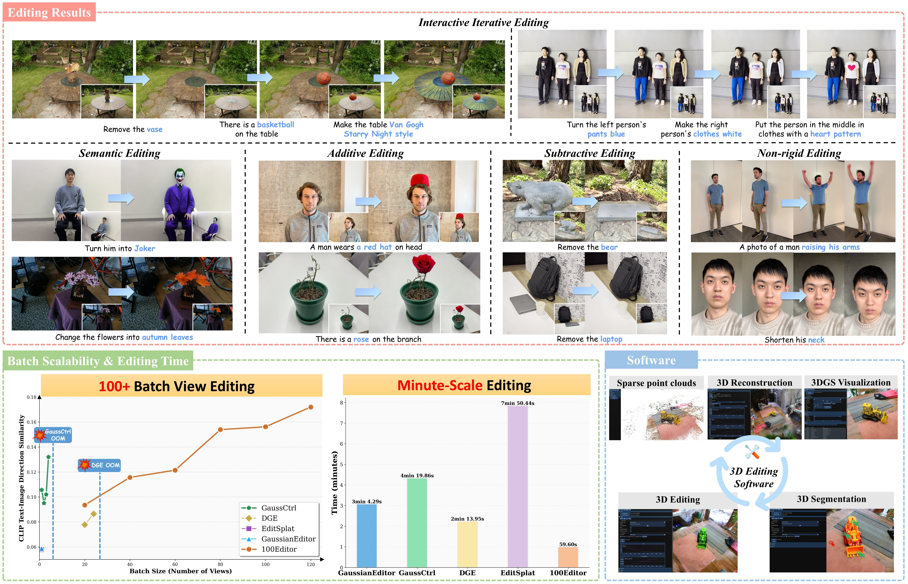
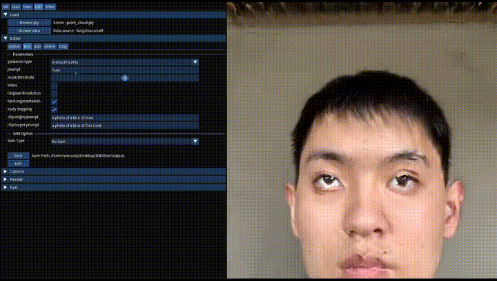
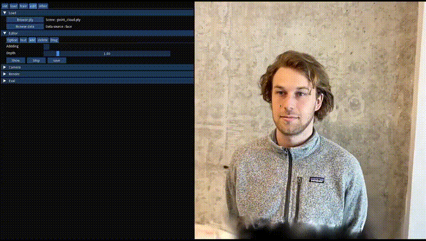
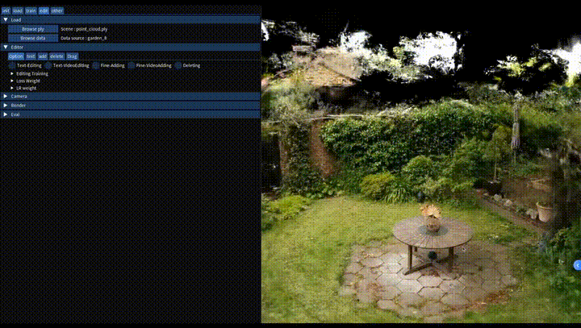
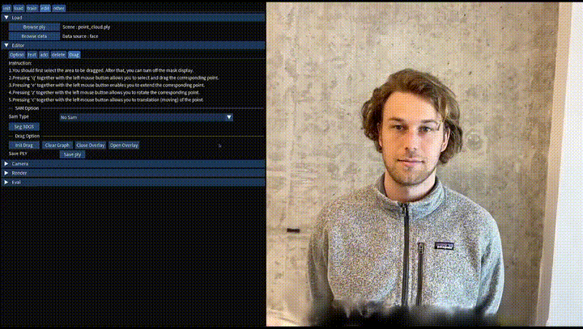

<p align="center">
  
  <br>
</p>
  
<h3 align="center"><strong>[CVPR 2026(Findings)] 100Editor: 100+ Views per Batch and Minute-Scale View-Consistent 3D Editing</strong></h3>

<p align="center">
    <a href="https://github.com/Devin100086">Cunqi Wu</a><sup>1</sup>,</span>
    <a href="https://scholar.google.com/citations?hl=zh-CN&user=Hv0M87UAAAAJ">Peng Zhou</a><sup>†,1</sup>,</span>
    <a href="https://scholar.google.com/citations?user=mhPGcuwAAAAJ&hl=zh-CN">Jie Qin</a><sup>1</sup>,
    <a href="https://scholar.google.com/citations?hl=zh-CN&user=61b6eYkAAAAJ">Qi Tian</a><sup>2</sup>,
    <br>
    <sup>†</sup>Corresponding author.
    <br>
    <sup>1</sup>Nanjing University of Aeronautics and Astronautics,
    <br>
    <sup>2</sup>Huawei Technologies Ltd.
    <br>
</p>

<div align="center">

 <a href='https://openaccess.thecvf.com/content/CVPR2026F/papers/Wu_100Editor_100_Views_per_Batch_and_Minute-Scale_View-Consistent_3D_Editing_CVPRF_2026_paper.pdf'></a> &nbsp;&nbsp;&nbsp;&nbsp;&nbsp;
 <a href='https://devin100086.github.io/100Editor/'></a> &nbsp;&nbsp;&nbsp;&nbsp;&nbsp;
 <a href='https://www.youtube.com/watch?v=TdZIICSFqsU&ab_channel=YiwenChen'></a> &nbsp;&nbsp;&nbsp;&nbsp;&nbsp;
 <a href='https://devin100086.github.io/100Editor-Document'></a> &nbsp;&nbsp;&nbsp;&nbsp;&nbsp;

</div>

<p align="center">
  
</p>


## :loudspeaker:News

 **[2026-04]** :fire: We release the code of 100Editor and the 3D editing software of 100Editor！
 
 **[2026-02]** :tada: 100Editor has been accepted to CVPR 2026(Findings)!

## :computer: Software

100Editor comes with an interactive desktop software that wraps the full pipeline — reconstruction, segmentation, and every editing mode — into a single GUI. Below are four editing modes in action.

<table align="center">
  <tr>
    <td align="center" width="50%">
      
      <br><b>Semantic Editing</b>
    </td>
    <td align="center" width="50%">
      
      <br><b>Additive Editing</b>
    </td>
  </tr>
  <tr>
    <td align="center" width="50%">
      
      <br><b>Subtractive Editing</b>
    </td>
    <td align="center" width="50%">
      
      <br><b>Non-rigid (Drag) Editing</b>
    </td>
  </tr>
</table>

<p align="center">
  📖 More detailed operation walkthroughs and additional features are covered in the <a href="https://devin100086.github.io/100Editor-Document"><b>Documentation</b></a>.
</p>

## :bookmark_tabs:TODOs
- [ ] Perform a deeper cleanup and refactoring of the codebase, along with thorough testing, so that **100Editor becomes easier to use, maintain, and customize for everyone**:grinning:. 
- [ ] Provide more complete installation and configuration instructions.
 
## :wrench: Installation
Our environment has been tested on an NVIDIA RTX 4090 GPU with Ubuntu 22.04 and CUDA 12.4.
1. Clone our repository
```
git clone https://github.com/Devin100086/100Editor.git --recursive
```
2. create environment and install dependencies
```
# Create an environment
conda create -n 100Editor python=3.11

# Install dependencies
pip install torch==2.4.1+cu124 torchvision==0.19.1+cu124 torchaudio==2.4.1+cu124 --index-url https://download.pytorch.org/whl/cu124
pip install -r requirements.txt
pip install -e third_party/BrushNet
pip install -e third_party/LeftRefill
pip install -e third_party/sam2
pip install -e third_party/threestudio

pip install -e src/trainer/origin/submodules/diff-gaussian-rasterization
pip install -e src/editor/gaussiansplatting/submodules/acc-diff-gaussian-rasterization-editor
pip install -e third_party/gaussiansplatting/submodules/diff-gaussian-rasterization
pip install -e third_party/dreamgaussian/add_diff-gaussian-rasterization
pip install -e src/trainer/origin/submodules/fused-ssim
pip install -e src/trainer/origin/submodules/simple-knn
```
3. Download the required model checkpoints
```
sh ./scripts/download.sh
```
## :fire: Train 3DGS
For video-captured scenes, preprocessing is required before 3DGS training, including frame extraction and Structure-from-Motion (SfM). Both steps can be completed within our software. For additional implementation details, you can also refer to the official [Gaussian Splatting](https://github.com/graphdeco-inria/gaussian-splatting) repository.
### Command-line training
Use the following command to reconstruct a target 3DGS scene:
```bash
bash scripts/train/train_3dgs.sh \
  [--use-depth-loss] \
  [--use-appearance-embedding] \
  <scene_path> \
  <output_dir> \
  <checkpoint_iter>
```

**Arguments**:

| Argument | Description | Required |
| --- | --- | --- |
| `--use-depth-loss` | Enable depth supervision during training. | No |
| `--use-appearance-embedding` | Enable appearance embedding optimization. | No |
| `<scene_path>` | Path to the input scene directory. | Yes |
| `<output_dir>` | Directory for checkpoints, logs, and outputs. | Yes |
| `<checkpoint_iter>` | Iteration to load as the initialization checkpoint. | Yes |
### GUI-based 3DGS training
The application also supports 3DGS training through the GUI. It includes support for training with the `gsplat` library and provides multiple training strategy options. For more details, refer to the GUI training documentation.
## :art: Editing
### :zap: Quick Start
Use the following command to perform semantic editing on a scene:
```bash
python launch.py \
  --config configs/edit_configs/edit-n2n.yaml \
  --train --gpu 0 \
  exp_root_dir="runtime/experiments/edit/semantic" \
  data.source="/path/to/scene" \
  system.camera_update_per_step=500 \
  data.max_view_num=20 \
  system.per_editing_step=100000 \
  system.prompt_processor.prompt="[your editing instruction]" \
  system.gs_source="/path/to/point_cloud.ply" \
  system.batch=true
```

For local semantic editing, add a segmentation prompt:
```bash
python launch.py \
  --config configs/edit_configs/edit-n2n.yaml \
  --train --gpu 0 \
  exp_root_dir="runtime/experiments/edit/semantic" \
  data.source="/path/to/scene" \
  data.use_original_resolution=true \
  system.camera_update_per_step=500 \
  data.max_view_num=20 \
  system.per_editing_step=100000 \
  system.prompt_processor.prompt="[your editing instruction]" \
  system.seg_prompt="[Objects for local editing]" \
  system.gs_source="/path/to/point_cloud.ply" \
  system.batch=true
```
**Arguments**:

| Argument | Description | Required |
| --- | --- | --- |
| `--config configs/edit_configs/edit-n2n.yaml` | Path to the semantic editing config file. | Yes |
| `--train` | Run in training mode. | Yes |
| `--gpu 0` | GPU device index used for training. | Yes |
| `exp_root_dir="runtime/experiments/edit/semantic"` | Root directory for experiment logs, checkpoints, and exports. | No |
| `data.source="/path/to/scene"` | Path to the input scene directory. | Yes |
| `data.use_original_resolution=true` | Use the original image resolution instead of the fixed training resolution. | No |
| `system.camera_update_per_step=500` | Number of training steps between batch-view refreshes in batch mode. | No |
| `system.per_editing_step=100000` | Interval for regenerating per-view edited targets during training. Use a large value (or `0`) to reduce frequent updates. | No |
| `data.max_view_num=20` | Maximum number of training views sampled for semantic editing. | No |
| `system.prompt_processor.prompt="[your editing instruction]"` | Text instruction for semantic editing. | Yes |
| `system.seg_prompt="[Objects for local editing]"` | Segmentation prompt describing the local target region. | No (Yes for local editing) |
| `system.gs_source="/path/to/point_cloud.ply"` | Path to the source 3DGS PLY checkpoint. | Yes |
| `system.batch=true` | Enable batch-view editing workflow. | Yes |

For advanced parameter tuning, refer to the scripts under `scripts/semantic`, where additional optimization and control options are provided.

In addition to semantic editing, the software supports additive editing, subtractive editing, and non-rigid editing. The GUI also provides interactive segmentation tools for more precise local editing. For detailed usage instructions, refer to the software documentation.

### :exclamation: Notes
For **subtractive editing**, the original paper used the `gemini-2.0-flash` image editing model. Since this model is no longer officially available, our implementation uses `Qwen-Image-Edit-Max` for single-view object removal. For API setup instructions, see the [API Guide](https://help.aliyun.com/zh/model-studio/get-api-key). The service can be accessed through the [API Platform](https://bailian.console.aliyun.com).
## :pencil: Rendering & Evaluation
For evaluation, we report CLIP and MEt3R scores. See the [Evaluation Guide](./docs/evaluation.md) for detailed instructions.


## :pray: Acknowledgments
We sincerely appreciate these excellent open-source projects.

<center>
<table>
  <tr>
    <th>Project</th>
    <th>Link</th>
  </tr>
  <tr>
    <td>Gaussian Splatting</td>
    <td><a href="https://github.com/graphdeco-inria/gaussian-splatting">graphdeco-inria/gaussian-splatting</a></td>
  </tr>
  <tr>
    <td>GaussianEditor</td>
    <td><a href="https://github.com/buaacyw/GaussianEditor">buaacyw/GaussianEditor</a></td>
  </tr>
  <tr>
    <td>DGE</td>
    <td><a href="https://github.com/silent-chen/DGE">silent-chen/DGE</a></td>
  </tr>
  <tr>
    <td>InstructPix2Pix</td>
    <td><a href="https://github.com/timothybrooks/instruct-pix2pix">timothybrooks/instruct-pix2pix</a></td>
  </tr>
  <tr>
    <td>BrushEdit</td>
    <td><a href="https://github.com/TencentARC/BrushEdit">TencentARC/BrushEdit</a></td>
  </tr>
  <tr>
    <td>dreamgaussian</td>
    <td><a href="https://github.com/dreamgaussian/dreamgaussian">dreamgaussian/dreamgaussian</a></td>
  </tr>
  <tr>
    <td>VidToMe</td>
    <td><a href="https://github.com/lixirui142/VidToMe">lixirui142/VidToMe</a></td>
  </tr>
</table>
</center>

## :pushpin: Citation
```bibtex
11
``` 

## :star: Star History
<a href="https://www.star-history.com/?repos=Devin100086%2F100Editor&type=date&legend=top-left">
 <picture>
   <source media="(prefers-color-scheme: dark)" srcset="https://api.star-history.com/chart?repos=Devin100086/100Editor&type=date&theme=dark&legend=top-left" />
   <source media="(prefers-color-scheme: light)" srcset="https://api.star-history.com/chart?repos=Devin100086/100Editor&type=date&legend=top-left" />
   
 </picture>
</a>

---
<div align="center">


**We hope that 100Editor provides you with a distinctive editing experience！**

**If you find this repository helpful, please give it a star ⭐**
</div>
